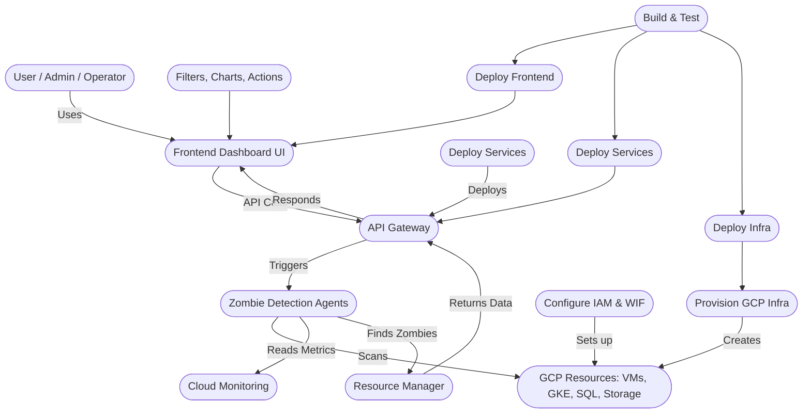

# 🧠 FinCortex - Zombie Resource Analyzer

> A multi-agent, AI-driven system for detecting and managing idle GCP resources

## 📦 Repository Structure

```
FinCortex-Mono/
├── frontend/         # React-based UI (Vite + TypeScript)
├── services/         # FastAPI backend & Cloud Run jobs
│   ├── backend/
│   └── jobs/
├── agents/           # Agent ADK and agent implementations
├── infrastructure/   # Terraform IaC for GCP
├── cicd/             # CI/CD scripts or docs
├── docs/             # Project documentation
└── .github/          # GitHub workflows, issue/PR templates
```

---

## 🗺️ System Architecture

### Application Flow



---

### CI/CD Pipeline Flow

```mermaid
flowchart TD
  GH([GitHub Repo])
  WF1([frontend.yml])
  WF2([services.yml])
  WF3([infrastructure.yml])
  WF4([cloudrun-jobs.yml])
  FE([Frontend (Cloud Host)])
  BE([Backend/API (Cloud Run)])
  INFRA([GCP Infra])
  JOBS([Cloud Run Jobs])

  GH --> WF1
  GH --> WF2
  GH --> WF3
  GH --> WF4

  WF1 --> FE
  WF2 --> BE
  WF3 --> INFRA
  WF4 --> JOBS
```

---

## 🚀 Quick Start

### Frontend
```bash
cd frontend
pnpm install
pnpm dev
```

### Services
```bash
cd services
# Setup instructions coming soon
```

### Infrastructure
```bash
cd infrastructure
# Terraform setup instructions coming soon
```

## 📝 Documentation

- [Frontend Documentation](./frontend/README.md)
- [Services Documentation](./services/README.md)
- [Infrastructure Documentation](./infrastructure/README.md)
- [CI/CD Documentation](./cicd/README.md)

## 🤝 Contributing
Please read [CONTRIBUTING.md](./CONTRIBUTING.md) for contribution guidelines.

## 📜 License
MIT © 2025 Vaibhav Shukla & FinCortex Team